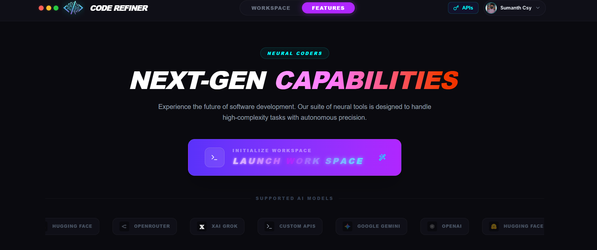
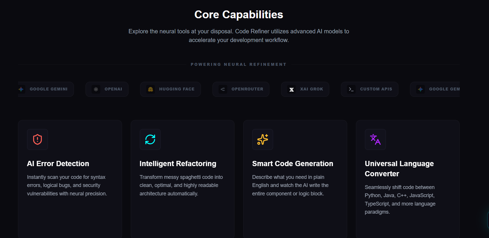
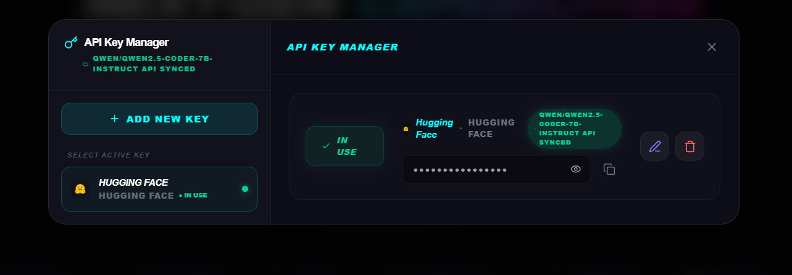
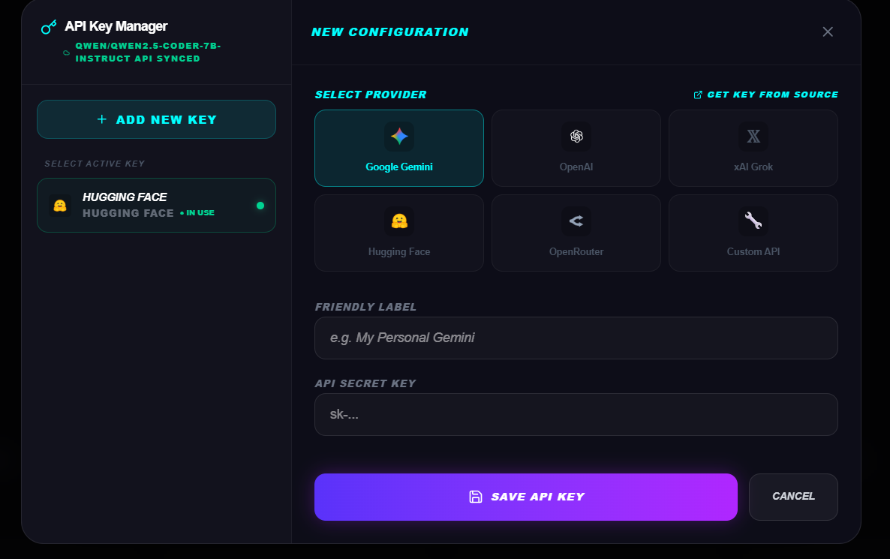
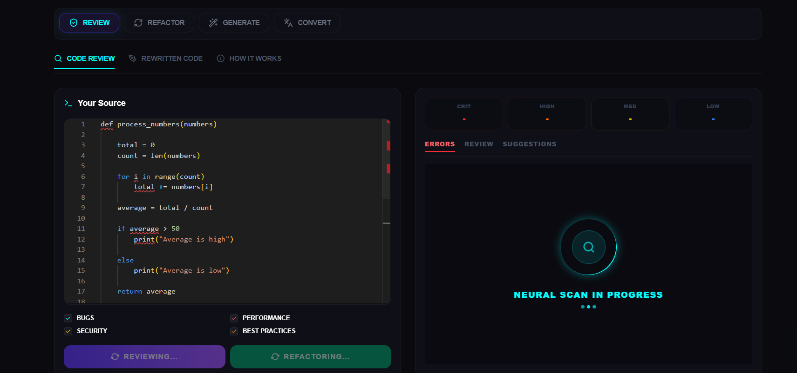
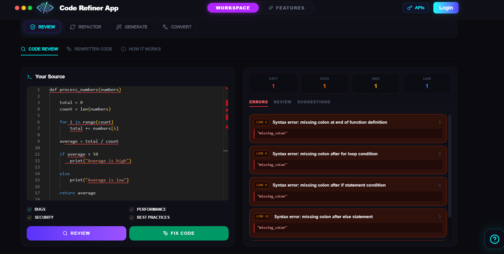
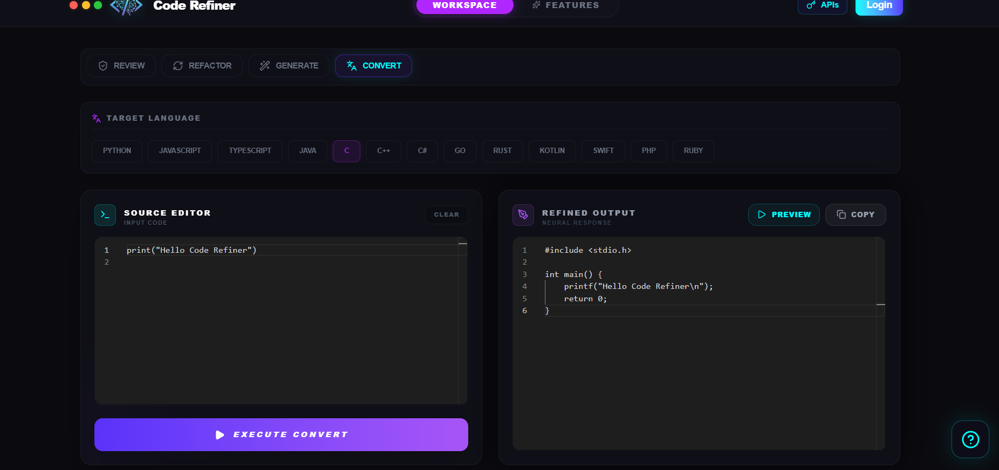
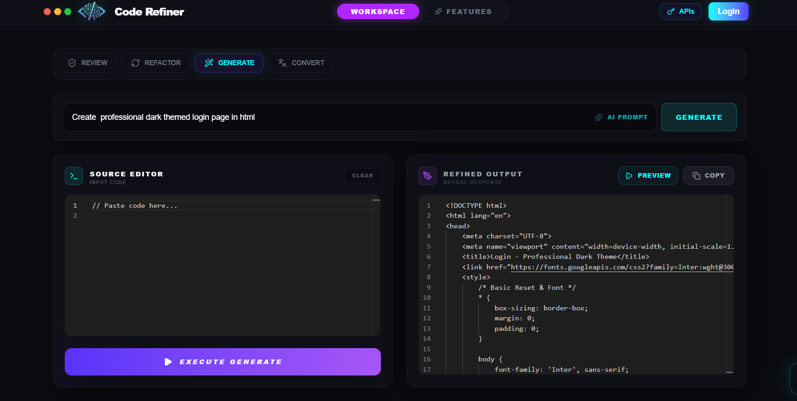
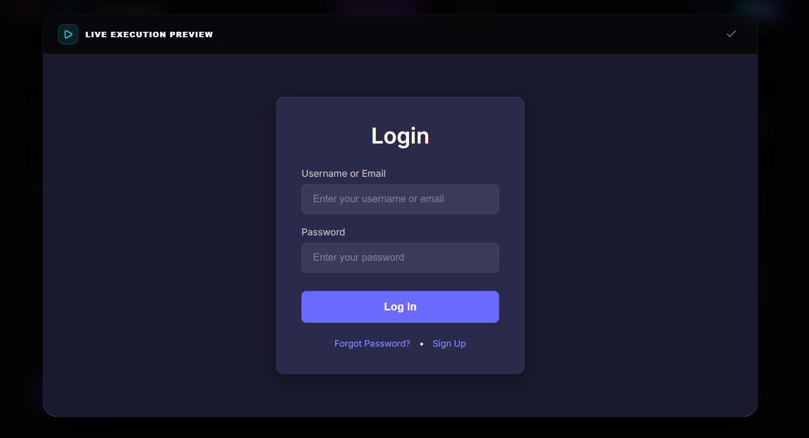
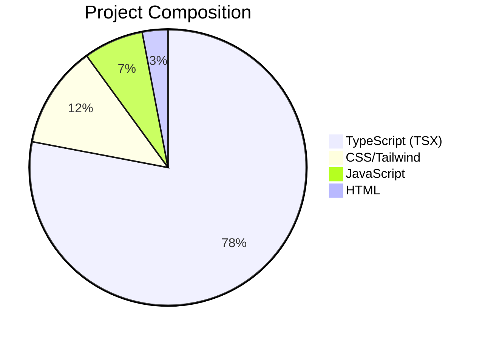

# 🛠️ Code Refiner: Neural Coding Forge
### *Gen-AI Forge Hackathon 2026 Entry*

[](https://github.com/SumanthCsy/Code-Refiner)
[](https://github.com/SumanthCsy/Code-Refiner)

Code Refiner is a high-performance, AI-driven development suite designed to elevate code quality through autonomous neural analysis. Built for the **Gen-AI Forge Hackathon 2026**, it provides developers with a professional-grade workspace to detect vulnerabilities, refactor architecture, and generate production-ready logic with surgical precision.

---

## 👥 The Team: Neural Coders
We are a specialized group of developers focused on bridging the gap between Generative AI and robust software engineering.

*   **Sumanth** – Team Lead & Lead Developer (Architect)
*   **Venu**
*   **Srinivas**
*   **Ajay**

---

## 🚀 App Overview
Code Refiner isn't just an editor; it's a **Neural Diagnostic Tool**. It analyzes codebases across 8 critical categories: Syntax, Runtime, Type, Logic, Quality, Security, Performance, and Best Practices.

### **Core Capabilities:**
*   🔍 **Neural Scanning:** Deep-scan code for hidden bugs and syntax errors.
*   ⚡ **Intelligent Refactoring:** Transform complex logic into clean, readable, and efficient architecture.
*   🏗️ **Code Generation:** Describe logic in plain English and receive fully functional components.
*   🌍 **Universal Conversion:** Seamlessly translate code between diverse language paradigms (Python, JS, TS, C++, Rust, etc.).
*   🎨 **Pro Workspace:** Integrated Monaco Editor with real-time error markers and high-fidelity themes.

---

| Category | Technology | Purpose |
| :--- | :--- | :--- |
| **Frontend Core** | [React 19](https://react.dev/) + [Vite](https://vitejs.dev/) | Component-based UI & lightning-fast build cycles. |
| **Styling** | [Tailwind CSS 4](https://tailwindcss.com/) | Advanced CSS utility framework for professional glassmorphism. |
| **Programming** | [TypeScript](https://www.typescriptlang.org/) | Type-safety and strict logic for mission-critical code. |
| **Auth & Data** | [Firebase](https://firebase.google.com/) | Secure Google Auth and Firestore for real-time API syncing. |
| **Code Editor** | [Monaco Editor](https://microsoft.github.io/monaco-editor/) | Desktop-class professional coding experience in the browser. |
| **Animations** | [Framer Motion](https://www.framer.com/motion/) | Cinematic UI transitions and fluid neural effects. |
| **Iconography** | [Lucide React](https://lucide.dev/) | Streamlined, consistent vector icons for the neural UI. |

---

## 🔄 The Flow
1.  **Authentication:** Secure login via Google Firebase.
2.  **Configuration:** Users sync their own API keys (encrypted/stored) for Gemini, OpenAI, Hugging Face, Grok AI, OpenRouter, or Custom API.
3.  **Input:** Paste source code or describe a feature in the workspace.
4.  **Neural Audit:** Select focus domains (Security, Performance, etc.) and launch the scan.
5.  **Refinement:** Review detailed issue report and apply the 100% error-free "Rewritten" solution.
6.  **Export:** Copy, Preview, or Clear workspace with one tap.

---

## 🤖 Supported AI Models
Code Refiner is model-agnostic and supports:
*   **Google Gemini** (1.5 Pro, 2.0 Flash)
*   **OpenAI** (GPT-4o, GPT-3.5)
*   **Anthropic Claude** (via OpenRouter/Custom)
*   **Hugging Face** (Llama, Mistral)
*   **xAI Grok** (Grok-1)
*   **Custom API:** Connect any local or private LLM endpoint.

---

## 📦 Local Installation
Follow these steps to get Code Refiner running on your local machine:


1.  **Install Dependencies:**
    ```bash
    npm install
    ```

2.  **Setup Environment:**
    Create a `.env` file in the root and add your keys (optional for local dev if using Firebase sync):
    ```env
    VITE_FIREBASE_API_KEY=your_key
    VITE_GEMINI_API_KEY=your_key
    ```

3.  **Start Development Server:**
    ```bash
    npm run dev
    ```
    *Access via `http://localhost:5173`*

---

## 📸 Screenshots
Visual tour of the Code Refiner interface.

| Landing Page | Capabilities |
| :---: | :---: |
|  |  |

| API Collections | API Configurations |
| :---: | :---: |
|  |  |

| Error Analysis | Error Dashboard |
| :---: | :---: |
|  |  |

| Code Translation | AI Generation |
| :---: | :---: |
|  |  |

| Live Preview |
| :---: |
|  |

---

## 📊 Languages Used



---

## 🎯 Conclusion
**Code Refiner** represents the next step in human-AI collaboration for software development. By automating the tedious parts of auditing and refactoring, we empower developers to focus on what matters: **Building the future.**

---

### 🌐 Socials & Contact
*   **Team Lead:** Sumanth
*   **Portifolio:** [NeuralCoders ](https://sumanthcsy.netlify.app)
*   **Hackathon:** Gen-AI Forge 2026

*© 2026 Neural Coders.| Code Smarter, Not Harder.*
